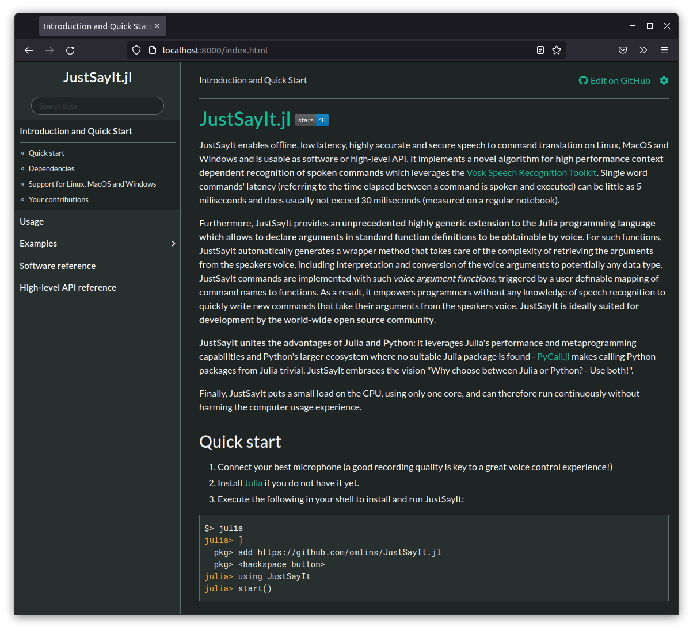

# JustSayIt

> :warning: JustSayIt was presented in a talk at JuliaCon 2022: [video of the talk](https://www.youtube.com/watch?v=W7oQb7pLc04), [abstract](https://pretalx.com/juliacon-2022/talk/H3N8UN) (the demo video mentioned in the talk was postponed to the next JuliaCon conference)

This is the source repository of the Julia package `JustSayIt.jl`. Please head to the [documentation website](https://omlins.github.io/JustSayIt.jl) to learn about its usage:

